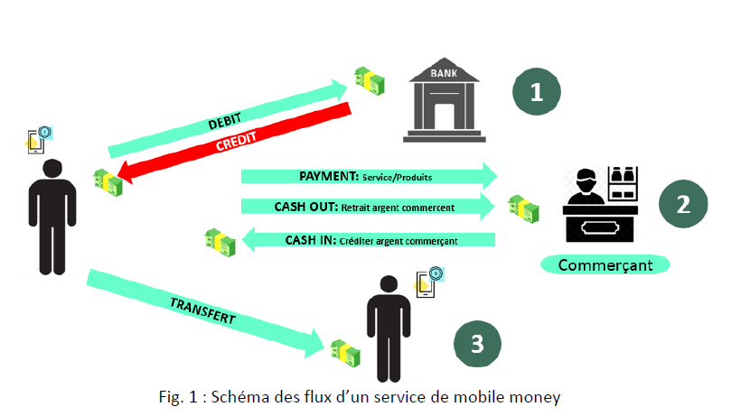
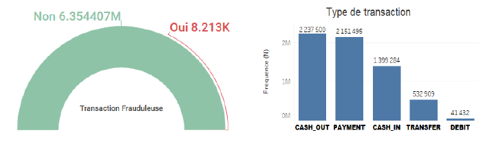

# MachineLearning_eMoneyFraud
L’objectif du projet a consisté à prédire une transaction financière frauduleuse qui pourrait survenir lors d’un service de mobile money.

## Flux d'un service mobile money

## Analyse exploratoire des données

L’analyse exploratoire des données a montré que moins de 1% (soit 8.213/6.362.620) de toutes les transactions étaient des transactions frauduleuses. Plus de 91% des transactions (soit 5788279/6362620) ont été type (Cash out (n = 2237500), Payment (n = 2151495) et Cas in (n = 1399284)). 

## Evaluation des modèles

Les modèles ML de decision trees ont semblé donner les meilleurs résultats comparativement aux modèles de régression logistique. Toutefois, les scores du train et test sont restés excessivement élevés, ce qui pourrait cacher un sur-apprentissage des différents modèles de ML.
Des améliorations dans l’avenir qui pourraient être d’envisager un approfondissement les différentes causes du sur-apprentissage du modèle ML. De plus, d’appliquer un modèle ML plus robuste XgBoost afin de prendre en compte l’asymétrique des données quantitatives et le déséquilibre des groupes de la variable d’intérêt.
